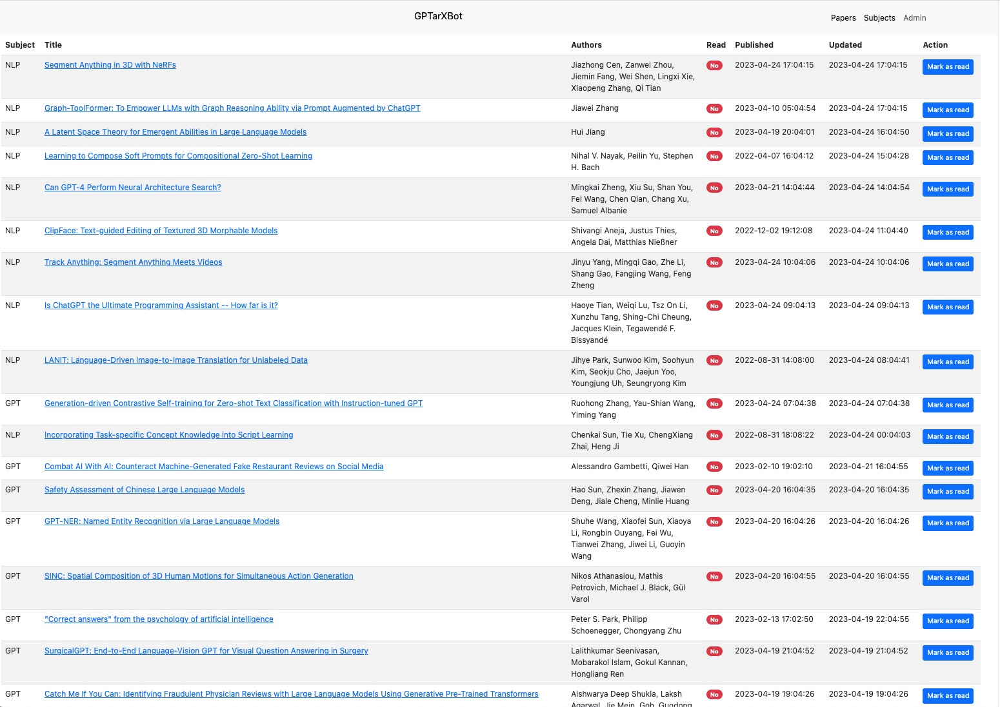
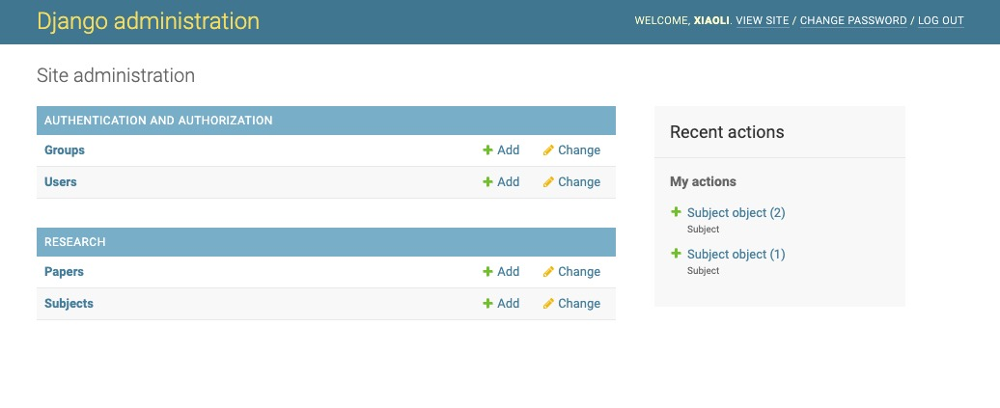
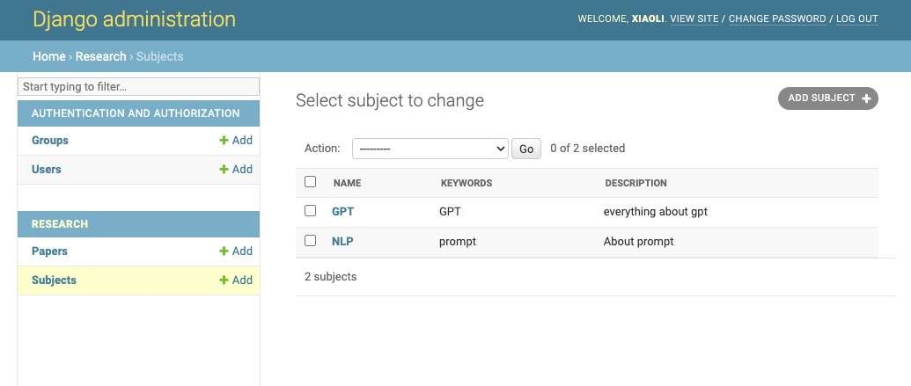
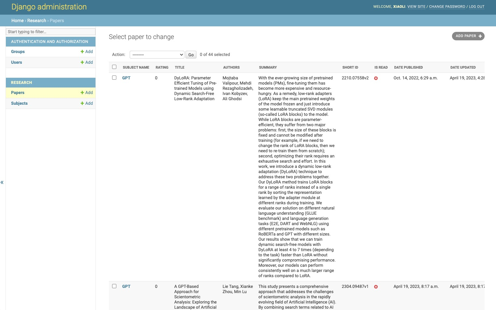
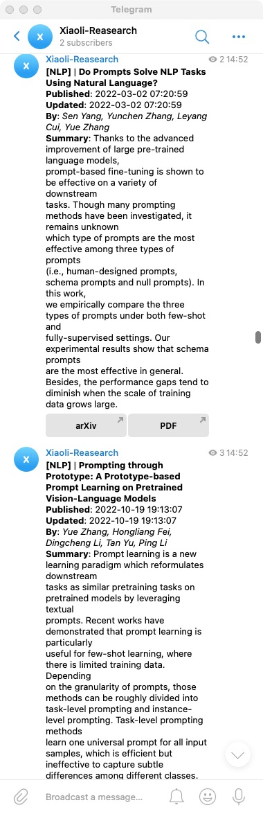

# GPTarXBot: A GPT-based arXiv Paper Bot

Welcome to the GPTarXBot project, an open-source AI-driven bot that helps users explore and discover research papers on arXiv. This bot is built using the GPT-4 architecture, which empowers it to provide paper summaries, filter papers based on your interests, and answer queries about specific papers or research topics. Our goal is to help researchers, students, and enthusiasts save time and efficiently find relevant research.

## Features

* **Paper Summarization**[TODO]: GPTarXBot can provide concise summaries of arXiv papers, allowing users to quickly understand the main contributions and findings of a study.
* **Paper Recommendation**: Based on user preferences and interests, the bot suggests relevant papers from arXiv's vast repository.
* **Topic-based Search**: Users can search for papers on specific topics or with particular keywords.
* **FAQ Answering**[TODO]: GPTarXBot can answer common questions about papers, such as methodology, results, and impact.

## Screenshots






## Getting Started Locally

1. **Clone the repository**
```
git clone https://github.com/xiaoli/GPTarXBot.git
```

2. **Navigate to the project directory**
```
cd GPTarXBot
```

3. **Install the required dependencies**
```
pip install -r requirements.txt
```

4. **DB migration**
```
python manage.py migrate
```

5. **Environment Variables**
```
cp env_example .env
EDIT .env TO FILL YOUR OWN SETTINGS
```

6. **Create a superuser account**
```
python manage.py createsuperuser
```

7. **Run the web server**
```
python manage.py runserver
```

8. **Add some interesting subjects**
```
Admin >> Home >> Research >> Subjects >> Add Subject
```

9. **Run the bot**
```
python manage.py grabpapers
```

<hr/>

## Getting Started on Heroku
Refer to [Getting Started on Heroku with Python
](https://devcenter.heroku.com/articles/getting-started-with-python "Getting Started on Heroku with Python")

### Heroku Scheduler
Heroku Scheduler >> Add job >> "python manage.py grabpapers" / Every 10 minutes

### Heroku App Settings >> Config Vars
Refer to [env_example](./env_example "Example of Vars"):
TELEGRAM_API_TOKEN='{AAA:BBB}'
TELEGRAM_CHANNEL_ID=-100{CHANNEL_ID}
ARXIV_HOST_URL='https://arxiv.org'
ENABLE_TELEGRAM_CHANNEL_MSG=True
ARXIV_MAX_RESULTS_COUNT=10
